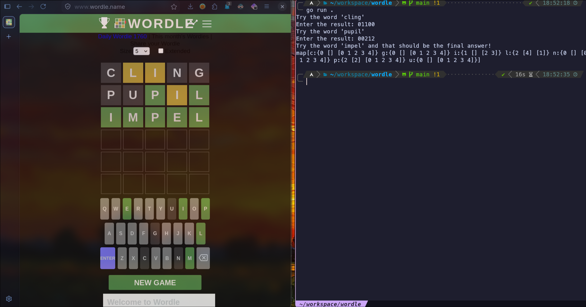

# How to cheat at Wordle :)



### Step one, clone:

```bash
git clone https://github.com/vilebile17/wordle-cheating
cd wordle-cheating
```

### Step two, watch the demonstration (cause github doesn't render videos):

```bash
mpv demonstration.mp4
```

### Step three: idk, have fun ig

```bash
go run .
```

> FYI, when it asks you for the result, a **0 is a grey square** (not in the word), a **1 is a yellow square** (in the word but in a different spot) and a **2 is a green square** (in the correct spot)

## How does it work?

Random numbers. Yep, I am lazy so random numbers do just fine :)
